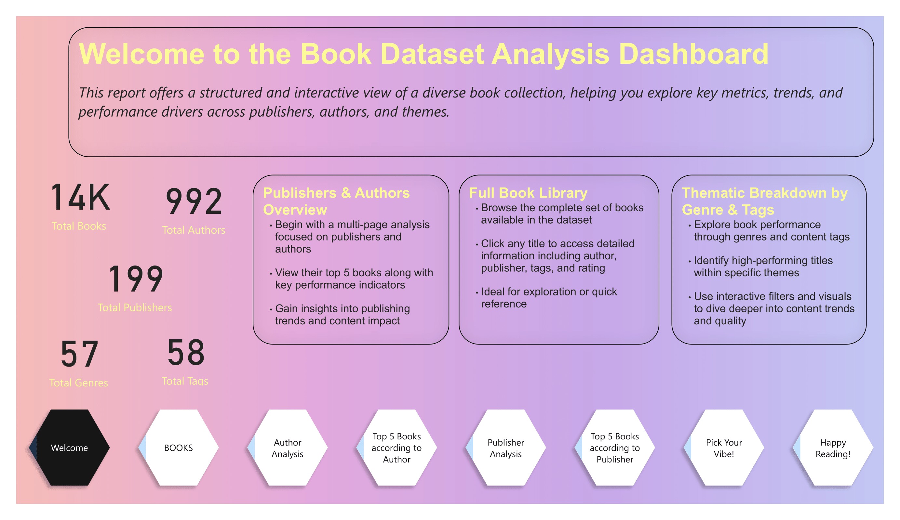
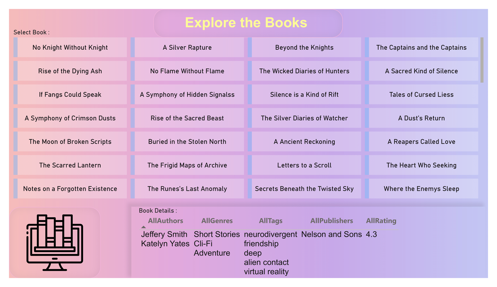
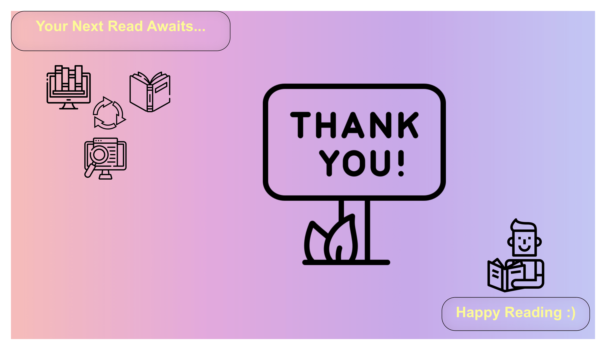
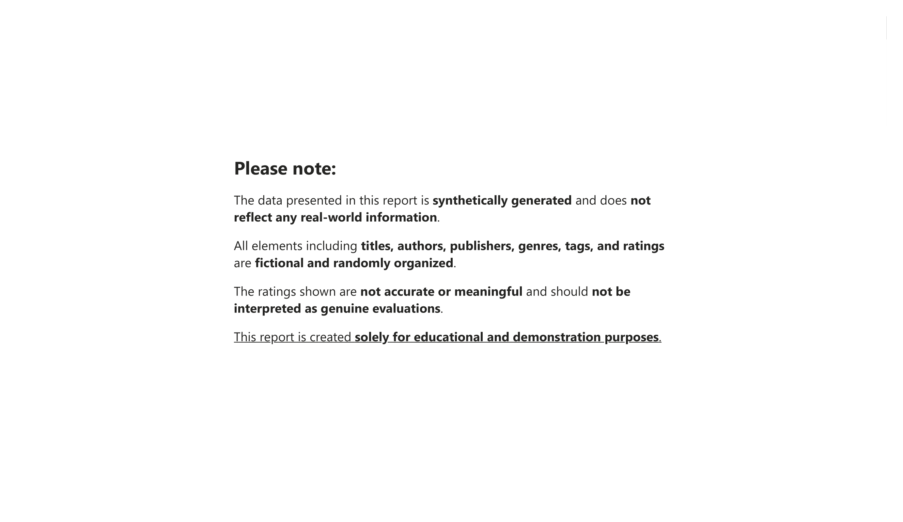

---

# Book Analytics Dashboard 

---

### Database Overview

A high-level view of the entire BookShelf database including books, authors, genres, tags, and publishers.

  <strong>SUMMARY REPORT</strong> 
  

Gain insights into the complete collection of books in the system. 

  <strong>Explore Books Dataset</strong> 
  

---

## Author & Publisher Performance Overview

#### Highest Rated Books by Selected Authors and Publishers
Explore top-rated book recommendations from selected authors and publishers.  
Analyze their performance and discover the top 5 books written by each author and published by each publisher.  
Evaluate their contributions across various genres and themes to gain insights into their reach, popularity, and content diversity.  

<table>
  <tr>
    <td align="center">
      <strong>Top 5 Books by the Author</strong> 
      
    </td>
    <td align="center">
      <strong>Top 5 Books by the Publisher</strong> 
      
    </td>
  </tr>
  <tr>
    <td align="center">
      <strong>Author's Diversity across Theme</strong> 
      
    </td>
    <td align="center">
      <strong>Publisher's Diversity across Theme</strong> 
      
    </td>
  </tr>
</table>

---

## TOP 5 Book Recommendations based on Theme

**Discover the most popular and top-rated books tailored to user preferences, filtered by genre and tag.**

  <strong>Top 5 based on Genre and Tag</strong> 
  

---

**Thank you and Disclaimer** 

  <table>
    <tr>
      <td align="center">
        <strong>Happy Reading!</strong> 
        
      </td>
      <td align="center">
        <strong>NOTE</strong> 
        
      </td>
    </tr>
  </table>

---

This project is licensed under the [Creative Commons License](LICENSE).

---
